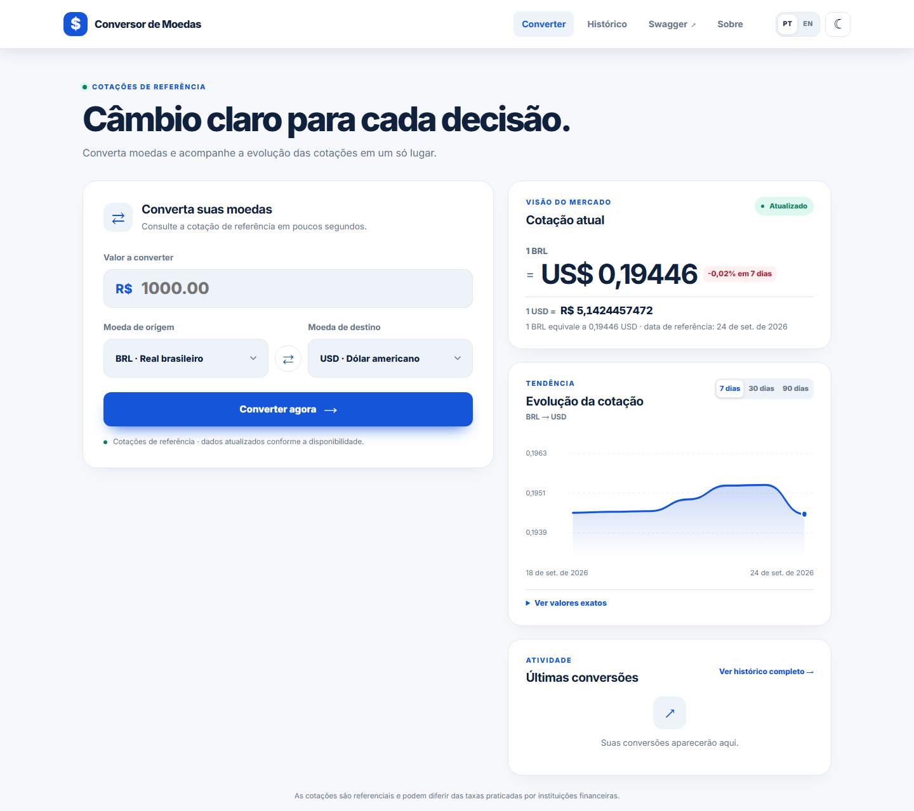
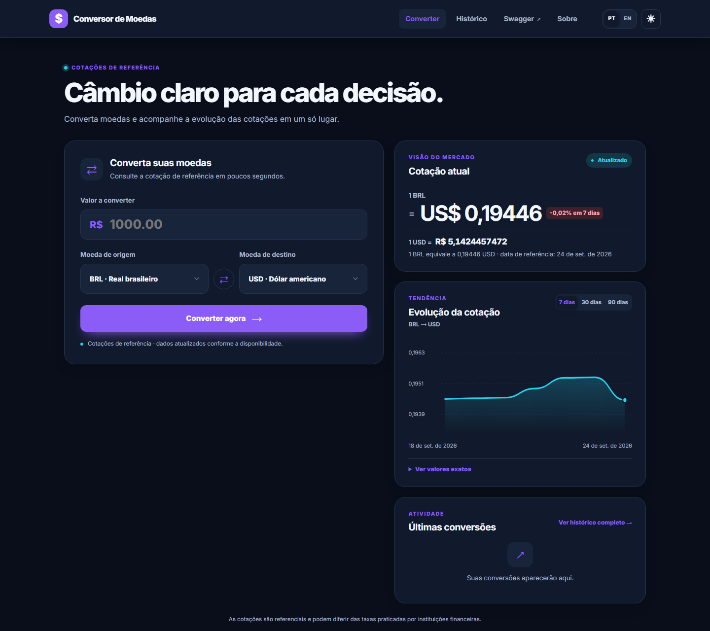

# Conversor de Moedas

Aplicação web para converter moedas e consultar a evolução das cotações. O resultado mostra a taxa utilizada e a data de referência. Cada conversão fica no histórico enquanto a aplicação estiver em execução.

## Telas

| Tema claro | Tema escuro |
| --- | --- |
|  |  |

Os prints mostram o dashboard em 21/09/2026. As cotações exibidas no site são consultadas durante o uso e podem mudar.

## O que dá para fazer

- Converter valores entre BRL, USD, EUR, GBP, JPY, CAD, ARS e CNY.
- Consultar o gráfico dos últimos 7, 30 ou 90 registros de cotação e abrir a tabela com os valores exatos.
- Ver as conversões recentes no dashboard ou o histórico completo na página **Histórico**.
- Alternar entre português e inglês e entre os temas claro e escuro. As escolhas ficam salvas no navegador.
- Consultar os endpoints pela interface do Swagger.
- Conhecer o criador do projeto e seus contatos na página **Sobre**.

## Executar localmente

É necessário ter o JDK 17 ou superior. Na raiz do projeto, execute:

```powershell
.\mvnw.cmd spring-boot:run
```

No macOS ou Linux, use `./mvnw spring-boot:run`.

| Página | Endereço |
| --- | --- |
| Conversor | http://localhost:8080/ |
| Histórico | http://localhost:8080/historico |
| Sobre | http://localhost:8080/sobre |
| Swagger | http://localhost:8080/swagger-ui.html |

O servidor se vincula somente a `127.0.0.1` por padrao; mantenha essa configuracao para uso local. O historico usa H2 em memoria e e global nesta demonstracao local. O console H2 fica desativado por padrao. Para habilita-lo durante o desenvolvimento local, defina `H2_CONSOLE_ENABLED=true` antes de iniciar e acesse `http://localhost:8080/h2-console` com JDBC `jdbc:h2:mem:currency_converter`, usuario `sa` e senha vazia. Nao habilite o console fora de um ambiente local isolado.

## API

| Método | Rota | Descrição |
| --- | --- | --- |
| `POST` | `/api/conversoes` | Converte um valor e salva a operação no histórico |
| `GET` | `/api/conversoes/historico` | Lista as conversões salvas |
| `DELETE` | `/api/conversoes/historico` | Limpa o histórico |
| `GET` | `/api/cotacoes/historico?origem=BRL&destino=USD&dias=7` | Consulta as cotações usadas pelo gráfico |

O parâmetro `dias` aceita `7`, `30` ou `90`. Uma conversão pode ser enviada assim:

```http
POST /api/conversoes
Content-Type: application/json

{"amount":100.00,"sourceCurrency":"BRL","targetCurrency":"USD"}
```

## Tecnologias e testes

O backend usa Java, Spring Boot, Spring Web, Spring Data JPA, Thymeleaf, Bean Validation e H2. A interface usa HTML, CSS, JavaScript e SVG. A documentação da API é gerada com Springdoc OpenAPI.

Para rodar os testes:

```powershell
.\mvnw.cmd test
```

As cotações servem como referência e podem ser diferentes das taxas oferecidas por instituições financeiras.

## Autor

Marcos Aurélio — estudante de Engenharia de Software e desenvolvedor em formação, com foco em back-end.

- [GitHub](https://github.com/MarcosAAurelio)
- [LinkedIn](https://www.linkedin.com/in/eu-marcosaurelio-dev)

## Observabilidade

O Actuator/OpenTelemetry e a captura de erros pelo Sentry estão configurados em modo local seguro por padrão. Consulte [docs/OBSERVABILITY.md](docs/OBSERVABILITY.md) para configurar OTLP, Sentry, Datadog ou New Relic.
