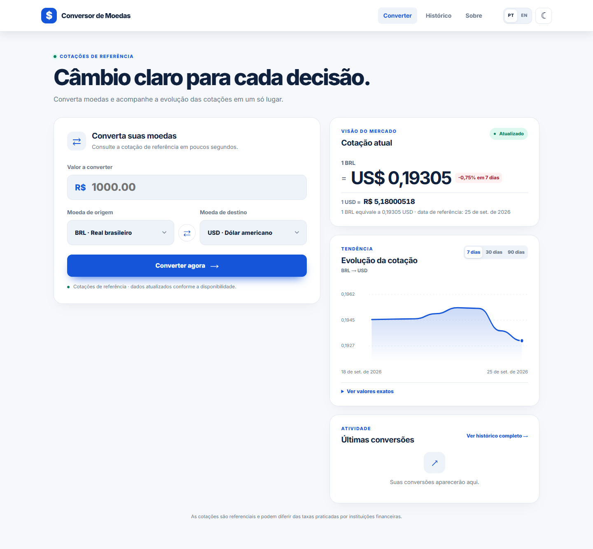
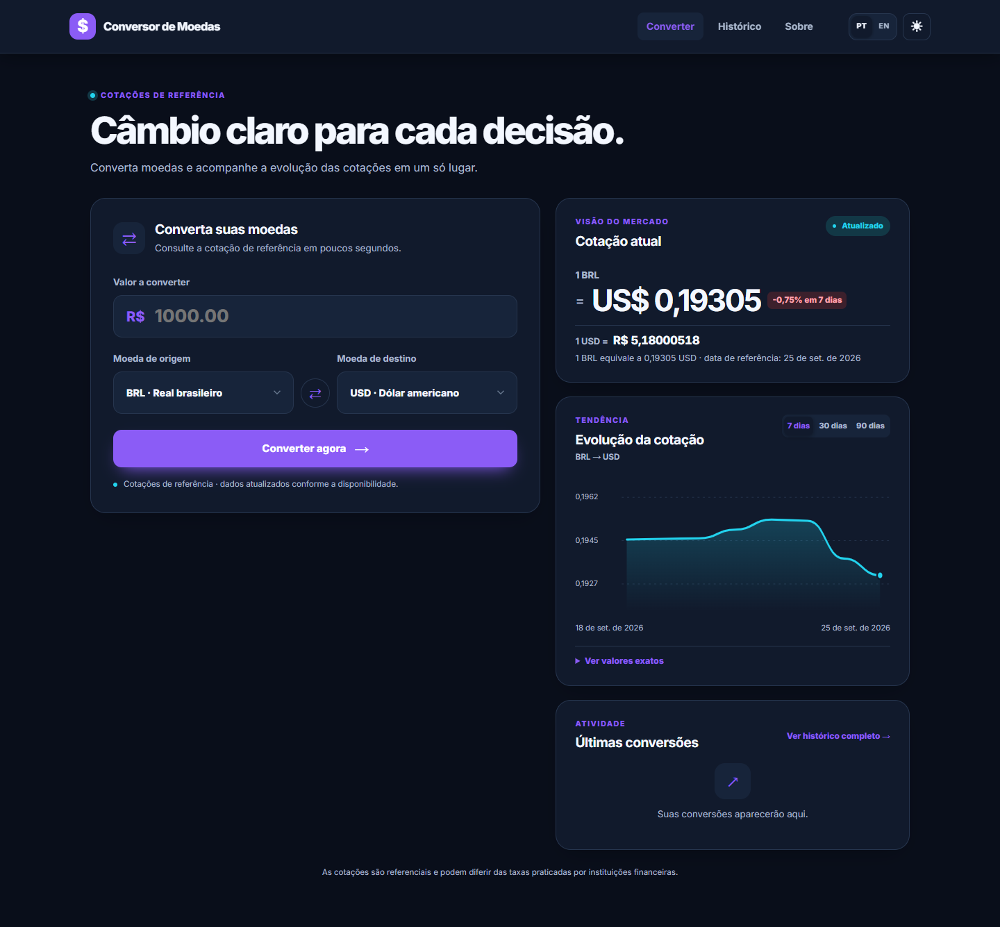
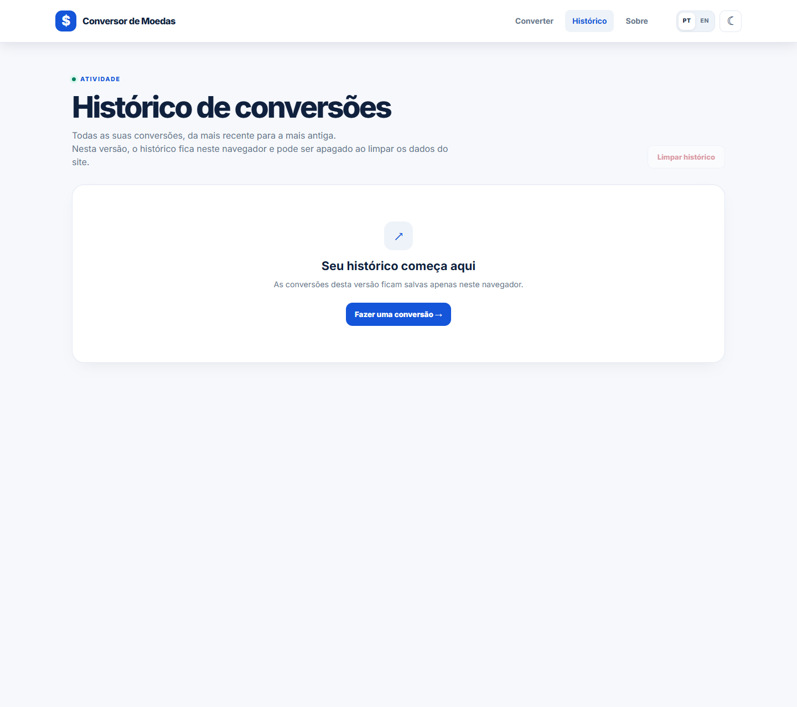
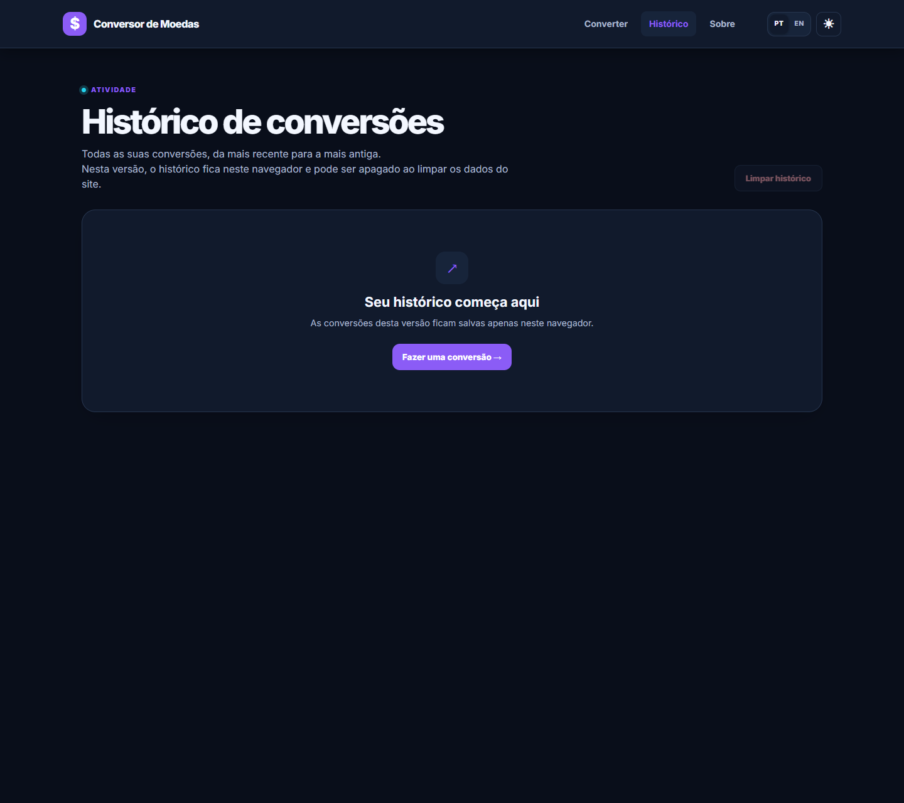

# Conversor de Moedas

Converta moedas e acompanhe cotações de referência, gráficos e conversões recentes.

**[Abrir a aplicação publicada](https://conversor-de-moedas.pages.dev/)**

Este repositório mantém a versão estática publicada no Cloudflare Pages e a aplicação Java com Spring Boot.

## Capturas de tela

As imagens mostram as páginas atuais do site publicado nos temas claro e escuro. As cotações são dinâmicas; o histórico depende das conversões feitas no navegador.

| Tela | Tema claro | Tema escuro |
| --- | --- | --- |
| Conversor |  |  |
| Histórico |  |  |
| Sobre |  |  |

## O que a versão publicada oferece

- Conversão entre BRL, USD, EUR, GBP, JPY, CAD, ARS e CNY.
- Cotação atual, cotação inversa e gráfico para períodos de 7, 30 ou 90 dias.
- Histórico de conversões salvo no armazenamento local do navegador. Os dados não sincronizam entre dispositivos.
- Interface em português ou inglês, com tema claro ou escuro.
- Página Sobre com informações do projeto e do autor.

As cotações vêm da [API pública Frankfurter](https://frankfurter.dev/) e são valores de referência. Podem diferir das taxas oferecidas por instituições financeiras.

## Duas versões no repositório

| Versão | Características |
| --- | --- |
| [Cloudflare Pages](https://conversor-de-moedas.pages.dev/) | Site estático em HTML, CSS e JavaScript. Consulta as cotações no navegador e salva o histórico no `localStorage`. Não inclui a API REST, o Swagger nem o banco da aplicação Java. |
| Aplicação Java | Spring Boot, páginas Thymeleaf, API REST e Spring Data JPA. O perfil local usa H2; o perfil `prod` usa PostgreSQL. O histórico é separado por sessão. |

Na aplicação Java, a sessão anônima expira após 30 minutos de inatividade. O histórico mantém até 100 conversões por sessão e a retenção padrão em produção é de 30 dias, configurável por `HISTORY_RETENTION_DAYS`. Não há contas de usuário.

## Executar a aplicação Java

É necessário ter o JDK 17 ou superior. Na raiz do projeto, execute:

```powershell
.\mvnw.cmd spring-boot:run
```

No macOS ou Linux:

```sh
./mvnw spring-boot:run
```

| Página | Endereço local |
| --- | --- |
| Conversor | http://localhost:8080/ |
| Histórico | http://localhost:8080/historico |
| Sobre | http://localhost:8080/sobre |
| Swagger da API Java | http://localhost:8080/swagger-ui.html |

O perfil local usa H2 em memória e se vincula somente a `127.0.0.1`. Os dados locais são apagados quando a aplicação termina.

## API REST da aplicação Java

| Método | Rota | Descrição |
| --- | --- | --- |
| `POST` | `/api/conversoes` | Converte um valor e salva a operação no histórico da sessão |
| `GET` | `/api/conversoes/historico` | Lista as conversões da sessão |
| `DELETE` | `/api/conversoes/historico` | Limpa o histórico da sessão |
| `GET` | `/api/cotacoes/historico?origem=BRL&destino=USD&dias=7` | Consulta as cotações usadas pelo gráfico |

O parâmetro `dias` aceita `7`, `30` ou `90`. As operações `POST` e `DELETE` exigem CSRF: consulte primeiro `GET /api/security/csrf`, mantenha o cookie de sessão e envie o token no cabeçalho indicado por `headerName` na resposta. Esses endpoints pertencem à aplicação Java e não estão disponíveis na versão Pages.

## Publicar

- **Cloudflare Pages:** configure o comando `npm run build:pages` e o diretório de saída `cloudflare-pages/site`. O build usa os arquivos de `cloudflare-pages/content` e os recursos compartilhados da aplicação Java. Consulte o [guia de publicação](docs/DEPLOY_CLOUDFLARE_PAGES.md).
- **Docker Compose:** a stack Java usa Caddy para HTTPS, Nginx com limites por IP e PostgreSQL em rede interna. Configure `.env` a partir de `.env.example`, use três senhas aleatórias diferentes com pelo menos 32 caracteres, defina `DOMAIN`, abra as portas TCP 80/443 e execute `docker compose up --build -d`. O volume `database_data` persiste após `docker compose down`; removê-lo apaga o banco. Faça backups criptografados fora do servidor e teste a restauração.
- **Render:** consulte o [guia de deploy](docs/DEPLOY_RENDER.md).

## Desenvolvimento e qualidade

O build do Pages usa Node.js 24.21.0, definido em `.nvmrc`:

```sh
npm run build:pages
```

Para executar os testes Java:

```powershell
.\mvnw.cmd test
```

Lint, testes unitários, testes de integração e testes de navegador rodam nos Pull Requests. Os comandos locais e a configuração de qualidade estão em [docs/QUALITY.md](docs/QUALITY.md). Para observabilidade, consulte [docs/OBSERVABILITY.md](docs/OBSERVABILITY.md).

## Autor

Marcos Aurélio — estudante de Engenharia de Software e desenvolvedor em formação, com foco em back-end.

- [GitHub](https://github.com/MarcosAAurelio)
- [LinkedIn](https://www.linkedin.com/in/eu-marcosaurelio-dev)

Correções e melhorias seguem o fluxo descrito em [AGENTS.md](AGENTS.md).
